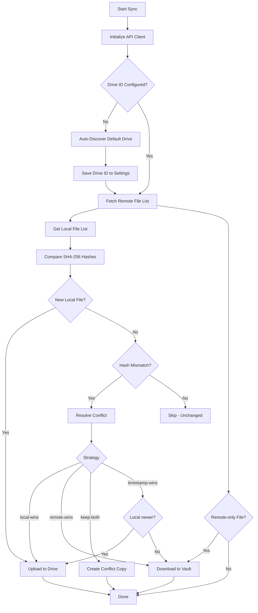

# 🔗 Obsidian ↔ here.now Sync Plugin

> Bidirectional synchronization between your Obsidian vault and [here.now](https://here.now) Drives (private cloud storage) or Sites (public URLs), with offline support, conflict resolution, secure API key storage, and comprehensive diagnostic logging.


---

## ✨ Features

### Core Sync Engine
- **🔄 Bidirectional Sync** — Local ↔ remote file synchronization with SHA-256 content-based change detection
- **⏱️ Periodic Auto-Sync** — Configurable intervals: 5min, 15min, 30min, 1h, 2h
- **📴 Offline Queue** — Changes are queued locally with exponential backoff retry; auto-syncs when connectivity returns
- **⚔️ Conflict Resolution** — Four strategies: timestamp-wins (last-write), local-wins, remote-wins, or keep-both (creates `.conflict-` copies)
- **🗑️ Smart Trash Handling** — Locally deleted files move to a `.trash/` folder instead of remote deletion (prevents accidental data loss)
- **📁 Full File Support** — Markdown, images, PDFs, binaries, attachments, code files (all MIME types supported)
- **🌐 Site Publishing** — Auto-publish synced Drive snapshots to public here.now Sites after successful sync

### Drive Auto-Discovery
- **🔍 Smart Drive Resolution** — When no Drive ID is configured, the plugin auto-discovers your default here.now Drive on first sync
- **💾 Persisted Drive ID** — Discovered Drive ID is saved to settings automatically; subsequent syncs use it directly
- **📋 Drive Info** — Shows connected Drive name, file count, and timestamps in sync logs

### Diagnostics & Troubleshooting
- **📋 Persistent Sync Logger** — In-memory log captures up to 500 entries with timestamps, severity levels, and operation categories
- **🔍 Context-Aware Error Messages** — Network errors show specific guidance (proxy/VPN detection, DNS failures, timeouts, SSL errors)
- **📤 Log Export** — Export all logs as formatted text for sharing/debugging (supports clipboard copy)
- **📊 Diagnostics UI** — Dedicated "Diagnostics" section in plugin settings with View Logs, Export All, and Clear buttons
- **⌨️ Debug Commands** — 3 commands accessible via Command Palette (Ctrl+P):
  - `View sync logs` — Copies last 30 entries to clipboard
  - `Export all sync logs to clipboard` — Full log history
  - `Clear sync logs` — Reset the log buffer

### Security
- **🔐 API Key Storage** — Keys stored in OS keychain via Obsidian's `SecretStorage` (Windows Credential Manager, macOS Keychain, Linux Secret Service)
- **⬇️ Fallback Storage** — On Obsidian versions without `keyVault` support, keys are stored encrypted in plugin settings
- **🧪 Safe Key Testing** — "Test Connection" button tests the API key **without saving it first** — no accidental key overwrites
- **🛡️ Secure by Default** — All API calls use HTTPS/TLS; no file contents logged; minimal permissions

### Network Resilience
- **📡 Online/Offline Detection** — Automatic detection via `navigator.onLine` events
- **🔄 Queue Processing** — Queued operations processed with exponential backoff (1s → 2s → 4s → 8s, max 30s)
- **⏱️ Sync Scheduling** — Skips periodic sync if another sync is already running (prevents concurrent operations)
- **🚦 Rate-Limiting Aware** — Built-in 200ms delay between operations to respect API quotas

### UI & UX
- **📊 Status Bar** — Live sync progress with percentage, elapsed time, and operation counters
- **📊 Status Bar Context Menu** — Allows to select specific actions, such as Publish to Site, view logs
- **🔔 Notifications** — Configurable modal notifications for sync events (enable/disable in settings)
- **🔄 Ribbon Icon in menu** — One-click sync by clickin gon the file, folder or inside the edited file

---

## 📥 Installation

### Option 1: BRAT (Recommended)
1. Install the [BRAT plugin](https://github.com/TfTHacker/obsidian42-brat)
2. Open BRAT settings → `Add a beta plugin`
3. Paste: `https://github.com/Nanocult/obsidian-here-now`
4. Enable in Community Plugins

### Option 2: Manual
1. Download the latest release (`obsidian-here-now.zip`)
2. Extract to `.obsidian/plugins/obsidian-here-now/` in your vault
3. Enable in `Settings → Community Plugins`

### Option 3: Development
```bash
git clone https://github.com/Nanocult/obsidian-here-now.git
cd obsidian-here-now
npm install
npm run dev
```
Copy `main.js`, `manifest.json`, and `styles.css` to your vault's plugin folder.

---

## ⚙️ Configuration

### 1. API Key Setup
1. Generate a key at [here.now Dashboard](https://here.now/#api-key)
2. Open plugin settings → `🔐 Authentication` → `Configure API Key`
3. Paste your API key → **Test** (validates without saving) → `Save & Close`

### 2. Sync Settings

| Setting | Description | Default |
|---------|-------------|---------|
| **Sync Interval** | Auto-sync frequency (5m / 15m / 30m / 1h / 2h) | 15 minutes |
| **Sync Scope** | Entire vault or specific folders | Entire vault |
| **Exclude Patterns** | Glob patterns to ignore | `*.tmp, *.log, .DS_Store, node_modules/**` |
| **Conflict Strategy** | How to handle simultaneous edits | Timestamp-wins |
| **Manual Merge Prompt** | Show dialog for conflicts | Enabled |
| **Trash Folder** | Local folder for deleted files | `.trash/` |

### 3. Storage Target
- **🔒 Drive (Default)** — Private storage on here.now that mirrors your vault structure
- **🌐 Site (Optional)** — Public URL. Enable `Auto-publish to Site` to snapshot Drive after sync

### 4. Diagnostics
- **📋 View Logs** — Copies last 30 log entries to clipboard
- **📤 Export All** — Exports complete log history for troubleshooting
- **🗑️ Clear** — Resets the in-memory log buffer

---

## 🎯 Commands

| Command | ID | Description |
|---------|----|-------------|
| Sync now with here.now | `sync-now` | Trigger manual full sync |
| Toggle periodic sync | `toggle-sync` | Enable/disable auto-sync |
| Publish current vault to here.now Site | `publish-to-site` | Manual Site publish |
| View sync logs | `view-sync-logs` | Copy recent logs to clipboard |
| Export all sync logs to clipboard | `export-all-sync-logs` | Full log export |
| Clear sync logs | `clear-sync-logs` | Reset log buffer |

All commands accessible via `Ctrl+P` (Command Palette).

---

## 🔄 How Sync Works



---

## 🗑️ Deletion Policy

- Local deletion → File moves to `.trash/` folder (excluded from sync)
- Remote deletion → **Ignored** (prevents accidental data loss)
- Manual review: Check `.trash/` folder in Obsidian or restore via plugin commands
- Remote trash not implemented — relies on local `.trash/` folder only

---

## 🌐 Offline Mode

- All file events are queued with timestamps and operation type
- Exponential backoff retry: 1s → 2s → 4s → 8s (max 3 attempts)
- Max queue size: 100 operations (oldest dropped if full)
- Auto-sync triggers immediately when `navigator.onLine` becomes `true`
- Status bar shows queue count when offline

---

## 🛡️ Security & Privacy

- ✅ API keys stored in OS keychain (Windows Credential Manager, macOS Keychain, Linux Secret Service)
- ✅ Fallback to encrypted settings storage on unsupported platforms
- ✅ All API calls use HTTPS/TLS
- ✅ No file contents logged or transmitted in plaintext
- ✅ Minimal permissions: `network`, `vault-access`
- ✅ Keys validated before saving ("Test" button tests without saving)
- ✅ Custom `X-HereNow-Client` header for API tracking

---

## ❓ Troubleshooting

| Issue | Solution |
|-------|----------|
| `Connection failed` | Verify API key; check network/VPN/proxy; use **View Logs** for details |
| `Rate limit exceeded` | Wait 1 hour or increase sync interval in settings |
| `Sync stuck` or timeout | Check **View Sync Logs** in Diagnostics section for errors |
| `Files not uploading` | Ensure file isn't in `.trash/` or excluded patterns |
| `Mobile sync fails` | Verify network permissions; avoid large binary files on cellular |
| `Conflict loop` | Switch to `local-wins` or enable `Manual Merge Prompt` |
| `TUNNEL_CONNECTION_FAILED` | Check Obsidian proxy settings (`Settings → About → Network proxy`); disable VPN |
| `Cannot read 'SetSecret'` | Plugin handles this automatically (falls back to settings storage) |

**Debug Mode**: Enable `Show Detailed Logs` in settings → Check **View Logs** in Diagnostics section or open DevTools (`Ctrl+Shift+I` → Console)

---

## 🛠️ Development

### Prerequisites
- Node.js 18+
- Obsidian Desktop (for testing)

### Commands
```bash
npm run dev        # Watch mode (auto-rebuild on save)
npm run build      # Production build (minified)
npm run lint       # ESLint check
npm run test       # Run Jest tests
```

### Project Structure
```
here-now-sync/
├── src/
│   ├── main.ts              # Plugin entry point & lifecycle
│   ├── settings.ts          # Settings UI (all configuration sections)
│   ├── auth.ts              # Secure API key management (keyVault + fallback)
│   ├── api/
│   │   ├── HereNowAPI.ts    # Base API client with JSON parsing & logging
│   │   ├── DriveAPI.ts      # here.now Drive endpoints (list, upload, download, delete)
│   │   └── SitesAPI.ts      # here.now Site publishing endpoints
│   ├── sync/
│   │   ├── SyncEngine.ts    # Core sync logic (detect changes, resolve conflicts, execute)
│   │   ├── OfflineQueue.ts  # Offline operation queue with retry
│   │   └── TrashManager.ts  # Local trash folder management
│   ├── ui/
│   │   ├── StatusBarManager.ts  # Sync progress & status display
│   │   └── modals/
│   │       └── ApiKeyModal.ts   # API key entry & test modal
│   └── utils/
│       ├── logger.ts        # Persistent sync logger with export
│       ├── hash.ts          # SHA-256 content hashing
│       └── path.ts          # Path normalization utilities
├── manifest.json            # Obsidian plugin manifest
├── styles.css               # Plugin styles (status bar, modals, progress)
├── esbuild.config.mjs       # Build configuration
├── version-bump.mjs         # Version management script
├── versions.json            # Version compatibility mapping
└── package.json             # Dependencies & scripts
```

---

## 🤝 Contributing

1. Fork & clone repository
2. Create feature branch (`git checkout -b feat/amazing-feature`)
3. Commit changes (`git commit -m 'Add amazing feature'`)
4. Push & open Pull Request

Please follow [Obsidian Plugin Guidelines](https://docs.obsidian.md/Home) and maintain TypeScript strict mode.

---

## 📄 License

[MIT](LICENSE) © 2026 Nanocult
