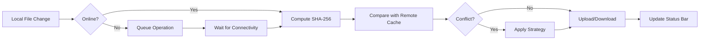

# 🔗 Obsidian ↔ here.now Sync Plugin

> Bidirectional synchronization between your Obsidian vault and here.now Drives (private) or Sites (public), with offline support, conflict resolution, and secure API key storage.


## ✨ Features

- **🔄 Bidirectional Sync**: Local ↔ remote file synchronization with SHA-256 change detection
- **⏱️ Periodic Auto-Sync**: Configurable intervals (5m, 15m, 30m, 1h, 2h)
- **📴 Offline Queue**: Changes are queued locally and auto-synced when connectivity returns
- **⚔️ Conflict Resolution**: Last-write-wins (timestamp), local/remote priority, or keep-both strategy
- **🗑️ Smart Trash Handling**: Deleted files move to a local `.trash/` folder instead of remote deletion
- **📁 Full File Support**: Markdown, images, PDFs, binaries, and attachments
- **🌐 Optional Site Publishing**: Auto-publish synced Drive snapshots to public here.now Sites
- **🔐 Secure Storage**: API keys stored in OS keychain via Obsidian's `SecretStorage`
- **📊 Real-time Feedback**: Status bar progress, modal notifications, and detailed logging
- **📱 Mobile Compatible**: No Node.js dependencies; works on Obsidian Desktop & Mobile

## 📥 Installation

### Option 1: BRAT (Recommended)
1. Install the [BRAT plugin](https://github.com/TfTHacker/obsidian42-brat)
2. Open BRAT settings → `Add a beta plugin`
3. Paste: `https://github.com/YOUR_USERNAME/here-now-sync`
4. Enable in Community Plugins

### Option 2: Manual
1. Download the latest release (`here-now-sync.zip`)
2. Extract to `.obsidian/plugins/here-now-sync/` in your vault
3. Enable in `Settings → Community Plugins`

### Option 3: Development
```bash
git clone https://github.com/YOUR_USERNAME/here-now-sync.git
cd here-now-sync
npm install
npm run dev
```
Copy the generated `main.js`, `manifest.json`, and `styles.css` to your vault's plugin folder.

## ⚙️ Configuration

### 1. API Key Setup
1. Generate a key at [here.now Dashboard → API Keys](https://here.now/dashboard/api-keys)
2. Open plugin settings → `Authentication` → `Configure API Key`
3. Paste key → `Test Connection` → `Save & Close`
*(Keys are encrypted and stored in your OS keychain)*

### 2. Sync Settings
| Setting | Description | Default |
|---------|-------------|---------|
| **Sync Interval** | Auto-sync frequency | 15 minutes |
| **Sync Scope** | Entire vault or specific folders | Entire vault |
| **Exclude Patterns** | Glob patterns to ignore | `*.tmp, *.log, .DS_Store` |
| **Conflict Strategy** | How to handle simultaneous edits | Timestamp-wins |
| **Manual Merge Prompt** | Show dialog for conflicts | Enabled |
| **Trash Folder** | Local folder for deleted files | `.trash/` |

### 3. Storage Target
- **🔒 Drive (Default)**: Private storage, mirrors vault structure
- **🌐 Site (Optional)**: Public URL. Enable `Auto-publish to Site` to snapshot Drive after sync

## 🔄 How Sync Works



### 🗑️ Deletion Policy
- Local deletion → File moves to `.trash/` folder (excluded from sync)
- Remote deletion → **Ignored** (prevents accidental data loss)
- Manual review: Check `.trash/` folder in Obsidian or restore via `Trash Manager` commands

### 🌐 Offline Mode
- All file events are queued with timestamps
- Exponential backoff retry (1s → 2s → 4s → 8s)
- Max queue size: 100 operations (oldest dropped if full)
- Auto-sync triggers immediately when `navigator.onLine` becomes `true`

## 🛡️ Security & Privacy

- ✅ API keys stored in OS keychain (Windows Credential Manager, macOS Keychain, Linux Secret Service)
- ✅ All API calls use HTTPS/TLS
- ✅ No file contents logged or transmitted in plaintext
- ✅ Minimal permissions: `network`, `vault-access`
- ✅ Rate-limit aware: Respects here.now API quotas with built-in delays

## 🛠️ Development

### Prerequisites
- Node.js 18+
- Obsidian Desktop (for testing)

### Commands
```bash
npm run dev        # Watch mode (auto-rebuild on save)
npm run build      # Production build (minified)
npm run lint       # ESLint check
npm run test       # Run Jest tests
```

### Project Structure
```
obsidian-here-now/
├── src/
│   ├── main.ts              # Plugin entry point
│   ├── settings.ts          # UI & configuration
│   ├── auth.ts              # Secure key management
│   ├── api/                 # here.now Drive & Sites clients
│   ├── sync/                # Sync engine, queue, trash manager
│   └── ui/                  # Status bar, modals
├── manifest.json            # Obsidian plugin manifest
├── styles.css               # Plugin styles
├── esbuild.config.mjs       # Build configuration
└── package.json             # Dependencies & scripts
```

## ❓ Troubleshooting

| Issue | Solution |
|-------|----------|
| `Connection failed` | Verify API key, check network, ensure here.now account is active |
| `Rate limit exceeded` | Wait 1 hour or increase sync interval |
| `Sync stuck at X%` | Check developer console (`Ctrl+Shift+I`) for errors |
| `Files not uploading` | Ensure file isn't in `.trash/` or excluded patterns |
| `Mobile sync fails` | Verify network permissions; avoid large binary files on cellular |
| `Conflict loop` | Switch to `local-wins` or enable `Manual Merge Prompt` |

**Debug Mode**: Enable `Show Detailed Logs` in settings → Check `Console` in Obsidian DevTools

## 🤝 Contributing

1. Fork & clone repository
2. Create feature branch (`git checkout -b feat/amazing-feature`)
3. Commit changes (`git commit -m 'Add amazing feature'`)
4. Push & open Pull Request

Please follow [Obsidian Plugin Guidelines](https://docs.obsidian.md/Home) and maintain TypeScript strict mode.

## 📄 License

[MIT](LICENSE) © 2026 Nanocult
